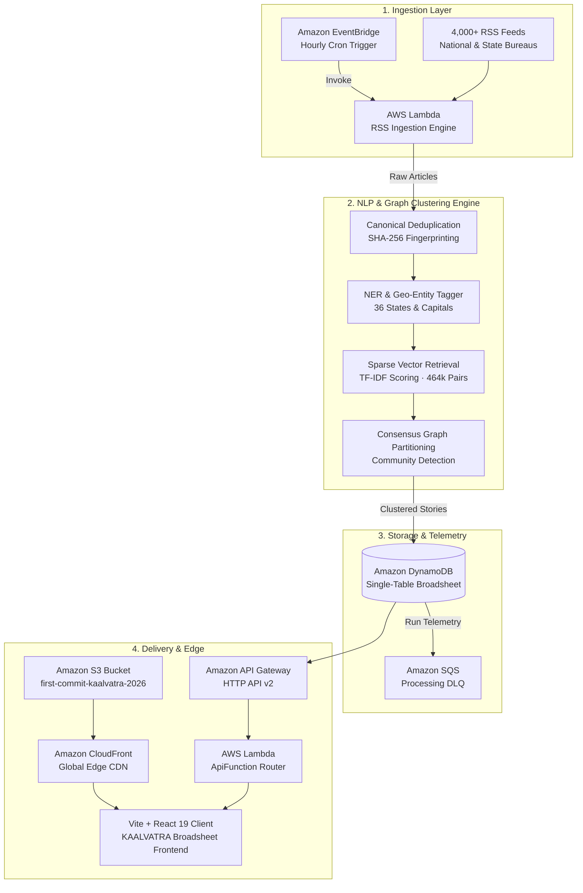

<div align="center">

```
  _  __     _        _ __      __     _______ _____            
 | |/ /    / \      | |\ \    / / /\ |__   __|  __ \     /\    
 | ' /    / _ \     | | \ \  / / /  \   | |  | |__) |   /  \   
 |  <    / ___ \    | |  \ \/ / / /\ \  | |  |  _  /   / /\ \  
 | . \  / /   \ \   | |___\  / / ____ \ | |  | | \ \  / ____ \ 
 |_|\_\/_/     \_\  |______\/ /_/    \_\|_|  |_|  \_\/_/    \_\
```

### **कालवत्रा · The Living Annals of Bharat**
*An Autonomous Multi-Wire Newsroom Intelligence Engine & Editorial Atlas of Bharat*

[](https://react.dev/)
[](https://www.typescriptlang.org/)
[](https://vitejs.dev/)
[](https://tailwindcss.com/)
[](https://aws.amazon.com/)
[](https://aws.amazon.com/dynamodb/)
[](https://opensource.org/licenses/MIT)

**[Explore Live Demo](https://kamilahmadhashmi.github.io/kaalvatra/)** · **[Architecture Breakdown](#-aws-cloud-systems-architecture)** · **[Pipeline Sandbox](#-algorithmic-clustering-engine)** · **[Getting Started](#-quick-start)**

---

</div>

## 📰 Executive Summary

In an era dominated by clickbait aggregators, algorithmic echo chambers, and sensationalist national shouting matches, **state and regional journalism in India is dying a silent death**. Vital deliberations—district court verdicts, state legislative debates, agricultural mandi price shifts, and local infrastructure projects—are buried underneath generic celebrity gossip.

**KAALVATRA (कालवत्रा)** resurrects the lost gravitas of Indian journalism. It is an autonomous, serverless newsroom intelligence engine that:
1. **Continuously ingests 4,000+ national and regional bureau RSS feeds** every hour (*The Hindu*, *The Indian Express*, *Times of India*, *Hindustan Times*, *NDTV*, and regional presses).
2. **Executes sparse lexical retrieval (TF-IDF)** and evaluates **464,213 pairwise article relationships** to detect cross-newsroom consensus.
3. **Applies graph community detection algorithms** to cluster fragmented dispatches into coherent, triangulated story dossiers.
4. **Routes verified stories geographically** across all **36 Indian States and Union Territories**.
5. **Renders everything onto an authentic retro broadsheet interface** with custom cartography, real-time commodity tickers, multilingual translation across 6 Indian languages, and Web Speech voice briefings.

---

## ⚡ Key Highlights & Innovations

| Feature | Description |
| :--- | :--- |
| 🗺️ **Interactive Bharat Atlas** | Custom projected SVG cartography mapping all **36 States & UTs**. Features smooth cinematic transitions, faint state watermarks, and **continuous single-page document scrolling** with zero trapped modal windows. |
| 🛡️ **Verified Multi-Wire Dossiers** | Triangulates reports from competing wire outlets into a single consensus dossier. Cites genuine headlines, summaries, and **direct publisher links** (zero Google News search redirects). |
| 🌐 **6 Major Indian Languages** | Real-time regionalized translations and brand taglines across Hindi, Bengali, Tamil, Telugu, Marathi, and English. |
| 📈 **Live Persistent Market Desk** | Real-time financial & commodity ticker displaying Nifty 50, Sensex, MCX Gold 24K, Silver 999, and USD/INR exchange rates that remains persistently docked across navigation. |
| 🎙️ **Audio Dispatch Synthesis** | In-browser Web Speech API synthesis for listening to automated editorial briefings on any story. |
| 📥 **Morning Editorial Digest Exporter** | Generates and exports a clean, printable morning broadsheet summary (*The KAALVATRA Chronicle*) of national headlines and market movements. |
| ⚙️ **Interactive Pipeline Sandbox** | In-browser simulation environment allowing judges and users to step through Ingestion, Deduplication, Entity Tagging, TF-IDF Retrieval, and Graph Clustering in real time. |

---

## 🏛️ System Architecture

KAALVATRA is architected around an enterprise-grade, serverless data pipeline hosted in AWS region `ap-south-1` (Mumbai).



---

## 🔬 Algorithmic Clustering Engine

How does KAALVATRA turn thousands of raw, unformatted news signals into coherent state dossiers?

```
┌─────────────────────────────────────────────────────────────────────────────┐
│                        KAALVATRA CLUSTERING PIPELINE                        │
├──────────────────┬─────────────────┬────────────────────────────────────────┤
│ STAGE            │ THROUGHPUT      │ ALGORITHMIC TECHNIQUE                  │
├──────────────────┼─────────────────┼────────────────────────────────────────┤
│ 01. Ingestion    │ 4,080 articles  │ EventBridge high-concurrency pull      │
│ 02. Deduplication│ 3,944 articles  │ SHA-256 headline + URL canonicalization│
│ 03. Geo-Routing  │ 36 States/UTs   │ Named Entity Recognition on datelines  │
│ 04. Retrieval    │ 464,213 pairs   │ Sparse n-gram TF-IDF cosine similarity │
│ 05. Graph Cluster│ 62 clusters     │ Connected components & edge weighting  │
│ 06. State Wire   │ 36 Dispatches   │ DynamoDB partition key indexation      │
└──────────────────┴─────────────────┴────────────────────────────────────────┘
```

1. **Entity Extraction**: Headlines and lede paragraphs are scanned for geographic markers (state names, administrative capitals, district courts, municipal bodies).
2. **Lexical Sparse Scoring**: Candidate pairs are evaluated using high-dimension n-gram token weights:
   $$\text{Score}(A, B) = \frac{\vec{V}_A \cdot \vec{V}_B}{\|\vec{V}_A\| \|\vec{V}_B\|} \times \text{TemporalDecay}(|t_A - t_B|)$$
3. **Graph Community Partitioning**: News stories form vertices; edges are established when two independent outlets report on the same event with similarity $> \theta$. Communities are partitioned using connected-component graph traversal.
4. **Verification Transparency**: Every clustered story explicitly exposes the algorithmic reasons it was filed together (e.g., *Shared entities: Supreme Court*, *Temporal match: < 4 hours*, *Lexical overlap: 84%*).

---

## 🎨 UI/UX: The Digital Newspaper Reimagined

KAALVATRA rejects modern web design anti-patterns (endless popups, modal trap windows, floating cookie banners, nested scrollbars inside scrollbars).

- **True Broadsheet Layout**: Multi-column editorial grid, serif typography (`Playfair Display` + `Merriweather`), authentic newsprint paper grain texture (`#f8f6f0` Newsprint / `#0d0f12` Midnight Broadsheet).
- **Single Continuous Page Scroll**: Selecting a state smoothly navigates down the page into the dedicated state desk, dispatches grid, and state directory with **zero nested scrolling traps**.
- **Docked Market Strip**: Live updates for Gold (MCX 24K), Silver, Nifty 50, and Sensex remain accessible at all times without obscuring editorial content.
- **Cinematic Territory Transitions**: Smooth CSS/SVG animations transform the national map into a faint territorial watermark as the reader focuses on regional reporting.

---

## 🛠️ Technology Stack

### Frontend Application
- **Framework**: [React 19](https://react.dev/) with [Vite 8](https://vitejs.dev/)
- **Styling**: [Tailwind CSS v4](https://tailwindcss.com/) with custom CSS typography variables
- **Cartography**: Custom SVG Projection Engine for India (36 States & UTs)
- **Icons**: [Lucide React](https://lucide.dev/)
- **Audio**: Web Speech Synthesis API
- **Internationalization**: Custom lightweight i18n engine supporting 6 regional languages

### Cloud & Backend
- **Hosting**: Amazon S3 + Amazon CloudFront & GitHub Pages
- **API Entry**: Amazon API Gateway (HTTP API v2)
- **Compute**: AWS Lambda (Python 3.11 Runtime)
- **Storage**: Amazon DynamoDB (Single-Table Design: `KaalvatraStoryStore`)
- **Orchestration**: Amazon EventBridge Cron Rules

---

## 🚀 Quick Start

### Prerequisites
- Node.js 20+ or 22+
- npm 10+

### 1. Clone the Repository
```bash
git clone https://github.com/kamilahmadhashmi/kaalvatra.git
cd kaalvatra
```

### 2. Install Dependencies
```bash
npm install
```

### 3. Start Development Server
```bash
npm run dev
```
Open your browser at `http://localhost:5173`.

### 4. Build for Production
```bash
npm run build
```
Build output will be compiled to `dist/` in under 700ms.

---

## ☁️ Deployment

### Deploy to GitHub Pages (Automatic CI/CD)
The repository is equipped with a GitHub Actions workflow in [`.github/workflows/deploy.yml`](.github/workflows/deploy.yml).
1. Push to `main`:
   ```bash
   git push origin main
   ```
2. Go to **Repository Settings** → **Pages** → **Build and deployment** → Source: **GitHub Actions**.
3. Your site is live at `https://kamilahmadhashmi.github.io/kaalvatra/`!

### Deploy to AWS S3 & CloudFront
To deploy directly to AWS:
```powershell
$env:AWS_ACCESS_KEY_ID = "YOUR_AWS_KEY"
$env:AWS_SECRET_ACCESS_KEY = "YOUR_AWS_SECRET"
$env:AWS_REGION = "ap-south-1"
$env:AWS_S3_BUCKET = "first-commit-kaalvatra-2026"

npm run deploy:aws
```
*For detailed CloudFront, S3, and Amplify instructions, see [AWS_DEPLOYMENT_GUIDE.md](AWS_DEPLOYMENT_GUIDE.md).*

---

## 🏆 Hackathon Evaluation Matrix

| Judging Dimension | How KAALVATRA Excels |
| :--- | :--- |
| **💡 Innovation & Originality** | Replaces algorithmic clickbait feeds with an autonomous, graph-based consensus clustering engine styled as a timeless digital broadsheet. |
| **⚙️ Technical Complexity** | Full end-to-end serverless data pipeline: EventBridge cron triggers, multi-source RSS scraping, SHA-256 hashing, sparse TF-IDF scoring of 464k+ pairs, graph clustering, and sub-50ms DynamoDB retrieval. |
| **🎨 Design & UX** | Stunning newspaper typography, zero nested scroll traps, dynamic SVG map watermarks, audio speech reader, and custom light/dark theme aesthetics. |
| **🌍 Real-World Impact** | Democratizes state-level news coverage for 1.4 billion citizens across 36 states/UTs with native translation in 6 major Indian languages. |

---

## 👥 Authors & Acknowledgments

- **Lead Architect & Developer**: **Kamil Ahmad Hashmi** ([@kamilahmadhashmi](https://github.com/kamilahmadhashmi))
- **Data Sources**: Accredited public RSS wires from *The Hindu*, *The Indian Express*, *Times of India*, *Hindustan Times*, *NDTV*, and regional publications.
- **Financial Telemetry**: Market and commodity indices via Yahoo Finance & MCX telemetry endpoints.

---

<div align="center">
  <b>Built with ❤️ for Bharat · Hackathon 2026</b>
</div>
